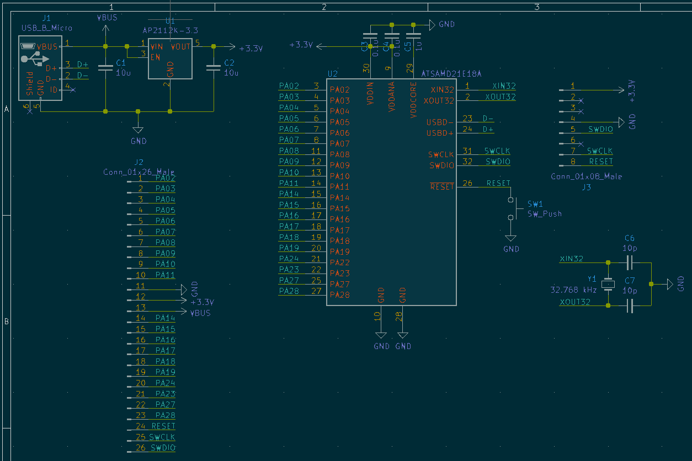

# Small SAMD21 breakout

**Note: I'm waiting for PCBs to arrive, so this project is currently untested.**

This is a small, simple breakout for the Microchip (formerly Atmel) [ATSAMD21E][] series of chips in the TQFP package. I designed it mostly for something to do while locked down at home, but also so that I could use the bare ICs I had spare from previous projects.

[ATSAMD21E]: https://www.microchip.com/wwwproducts/en/ATSAMD21E18

Most I/O pins are broken out, with the exception of PA00/01 (XIN32 and XOUT32 for the watch crystal) and PA24/25 (D- and D+ for USB). The SWD interface is available via either the header, or through the [SOICbite][] connector opposite the USB footprint. Only C2-C5 need to be populated to get the microcontroller working, but the regulator, crystal, reset button, and USB jack make things a bit more convenient. 

This design is based on Adafruit's [Trinket M0][] as well as Technoblogy's Minimal [ATSAMD21 Computer][minimalcomp].

[SOICbite]: https://github.com/SimonMerrett/SOICbite/
[Trinket M0]: https://www.adafruit.com/product/3500
[minimalcomp]: http://www.technoblogy.com/show?2833

## BoM

| Reference | Quantity | Value                      | Footprint                   |
| --------- | -------- | -------------------------- | --------------------------- |
| C1, C2    | 2        | 10 μF, > 6 V               | 0603                        |
| C3, C4    | 2        | 1 μF, > 4 V                | 0603                        |
| C5        | 1        | 0.1 μF, > 4 V              | 0603                        |
| J1        | 1        | Micro-USB jack             | [Molex 105017-0001][1]      |
| SW1       | 1        | Push switch                | [Alps SKRKAEE020][2]        |
| U1        | 1        | AP2112K-3.3                | SOT23-5                     |
| U2        | 1        | ATSAMD21Exx                | TQFP-32                     |
| Y1        | 1        | 32.768 kHz, < 12.5 pF load | [Micro Crystal CM7V-T1A][3] |

[1]: https://www.molex.com/molex/products/part-detail/io_connectors/1050170001
[2]: https://tech.alpsalpine.com/prod/e/html/tact/surfacemount/skrk/skrk_list.html
[3]: https://www.microcrystal.com/en/products/khz-quartz-crystals/cm7v-t1a/

## Schematic

